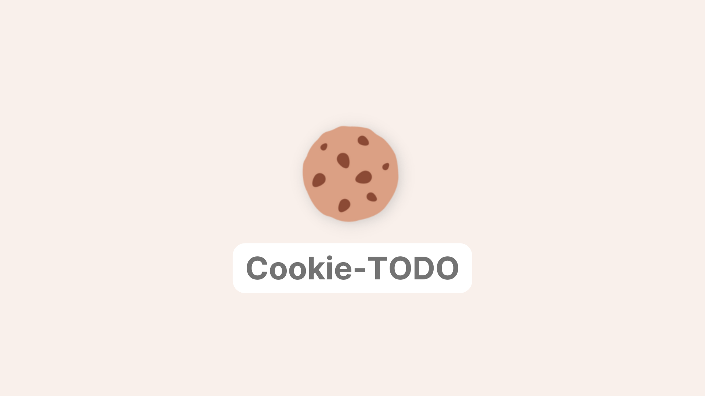

<p align="center">
  
</p>

<h1 align="center">🍪 Cookie-TODO 🍪</h1>
<p align="center">
  🎉 Cookieを利用したモダンなTODOリスト! 🎉
</p>


## 📝Motivation
Cookie-TODOは、日々の生活や仕事において、行うべきことややらなければならないことを整理するために役立つWebツールです。

1. 記憶の負担を軽減する
TODOリストを使うことで、頭の中に入れておく必要のあることを紙やアプリに書き出すことができます。これにより、記憶の負担が軽減され、集中力を維持することができます。

1. 優先順位を明確にする
TODOリストを使うことで、やるべきことを優先順位に従って整理することができます。これにより、重要なタスクを先に行うことができ、時間の効率を上げることができます。

1. タスクの漏れを防ぐ
TODOリストを使うことで、やらなければならないことを見落とすことがなくなります。また、タスクが完了したことをチェックすることで、どのタスクが残っているかを把握することができます。

1. ストレスを軽減する
TODOリストを使うことで、やるべきことが明確になり、タスクを完了するためのストレスを軽減することができます。また、TODOリストには達成感を得られるチェック欄があり、達成感を感じることができるため、モチベーションを保つことができます。

以上のように、Cookie-TODOは日々の生活や仕事において役立つツールです。特に、忙しい人や多くのタスクを抱えている人には、TODOリストを使うことで効率的に時間を使うことができます。


## 📚Repository overview


```

├── index.html
├── README.md
└── public
    ├── main_script.js
    └── main_style.css
    
```

## 🛠Running instructions

TODOリストの操作方法は以下の方法となります。

1. タスクの追加
TODOリストに新しいタスクを追加するには、画面下部にある入力欄にタスクの内容を入力し、「+」ボタンをクリックします。

1. タスクの削除
TODOリストからタスクを削除するには、削除したいタスクの内容をクリックして、削除ボタンをクリックします。

1. 定期的な確認
TODOリストは、定期的に確認して、進捗状況や優先度の見直しを行うことが重要です。

## 📡More resources

- js-cookie

     └[:octocat:github repository](https://github.com/js-cookie/js-cookie)


## 🤷🏼About

Hi 👋🏻, I'm doremire learning web development. UwU
